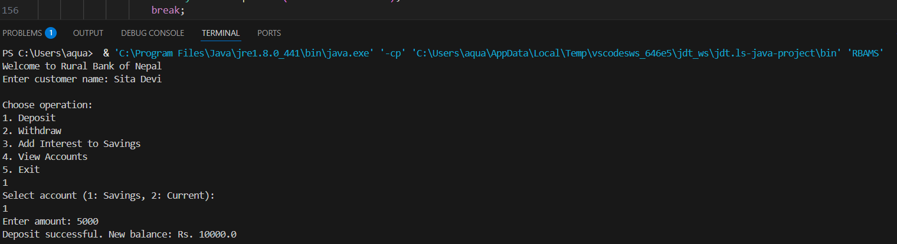
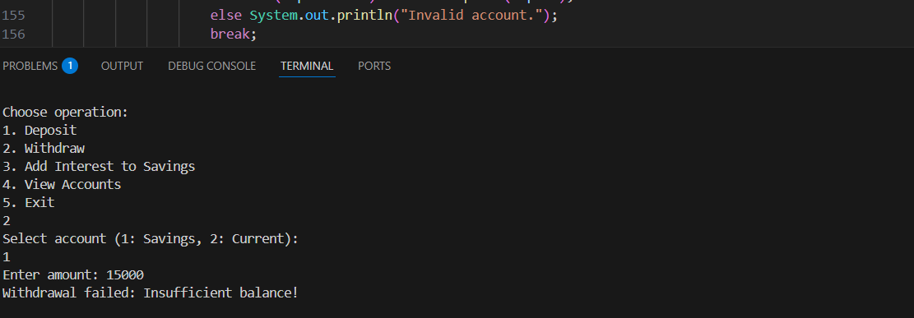
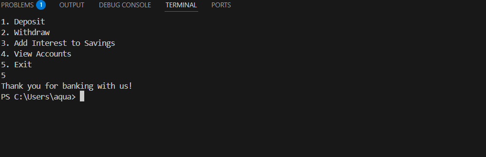

# RBAMS - Rural Bank Account Management System

This project simulates a basic Rural Bank Account Management System using Java and Object-Oriented Programming (OOP) principles.

# Features

- Create new accounts
- Deposit & Withdraw funds
- Display all accounts
- Search accounts by account number
- Exit system

# OOP Concepts Used

- **Encapsulation**: All account data is handled inside the `RBAMS` class through methods.
- **Abstraction**: User interacts with simple menu choices instead of seeing internal logic.

##Screenshots









# How to Run

1. Compile using:
   ```bash
   javac RBAMS.java
